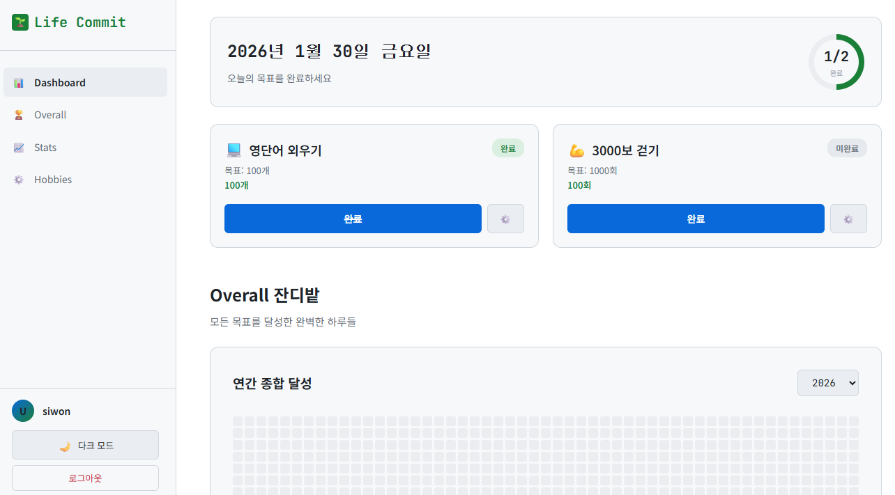

# 🌱 Life Commit

> GitHub 잔디밭 스타일의 습관 트래커

## 📸 스크린샷

## ✨ 주요 기능
- GitHub 스타일 잔디밭
- 수치형/완료형 목표
- 다크/라이트 테마

## 🚀 시작하기
1. 파일 다운로드
2. 브라우저에서 열기

## 📚 문서
- [상세 명세서](./Life_Commit_Final_Specification.md)

## 🛠 기술 스택
- HTML5, CSS3, JavaScript (Vanilla)
- LocalStorage

## 📄 라이선스

MIT

