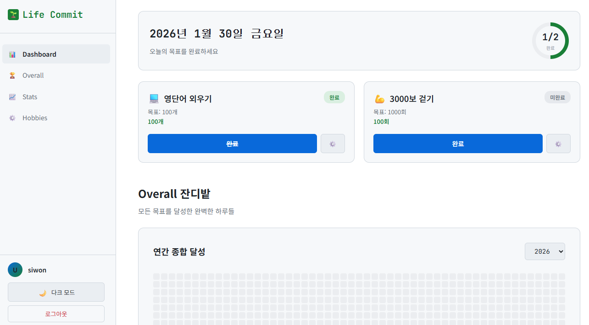

# Life Commit

> GitHub 잔디밭 스타일의 습관 트래커 — 하루의 성취를 커밋으로 기록하세요.



---

## 목차

- [소개](#소개)
- [주요 기능](#주요-기능)
- [기술 스택](#기술-스택)
- [프로젝트 구조](#프로젝트-구조)
- [시작하기](#시작하기)
- [백엔드 설정](#백엔드-설정)
- [배포](#배포)
- [라이선스](#라이선스)

---

## 소개

**Life Commit**은 GitHub의 기여 잔디밭에서 영감을 받은 습관 트래킹 웹 앱입니다. 매일 목표를 달성하면 잔디가 채워지고, 연속 달성 스트릭과 통계로 꾸준함을 시각화합니다.

- Firebase 인증으로 계정 관리
- 취미/습관별 개별 잔디밭 제공
- 모든 목표 달성 시 종합 잔디밭(Overall)에도 반영

---

## 주요 기능

| 기능 | 설명 |
|---|---|
| GitHub 스타일 잔디밭 | 취미별 + 종합 연간 활동 그래프 |
| 수치형 목표 | 예) 운동 30분, 물 2L |
| 완료형 목표 | 원클릭 토글로 빠른 기록 |
| 스트릭 추적 | 연속 달성 일수 및 최고 기록 |
| 다크/라이트 테마 | 테마 전환 지원 |
| Firebase 인증 | 이메일/비밀번호 로그인, 비밀번호 재설정 |
| 실시간 데이터 동기화 | Firestore 기반 클라우드 저장 |

---

## 기술 스택

**프론트엔드**
- HTML5, CSS3 (CSS Custom Properties)
- Vanilla JavaScript
- Firebase SDK v10 (Authentication + Firestore)
- 폰트: JetBrains Mono, Noto Sans KR

**백엔드** (`/backend`)
- Node.js + Express 4
- Firebase Admin SDK
- JWT + 리프레시 토큰 인증
- Jest (테스트, 커버리지 70% 이상)

**인프라**
- GitHub Pages (프론트엔드 배포)
- GitHub Actions (자동 배포)

---

## 프로젝트 구조

```
LifeCommit/
│
├── index.html                        # 메인 앱 (프론트엔드 전체)
│                                     # Firebase 인증, Firestore 연동,
│                                     # 잔디밭 UI, 습관 CRUD 포함
│
├── about.html                        # 서비스 소개 페이지
├── guide.html                        # 사용 방법 가이드
├── habit-tracker-tips.html           # 습관 트래커 활용 팁
├── habits-guide.html                 # 습관 형성 가이드
├── privacy-policy.html               # 개인정보처리방침
│
├── screenshots.png                   # 앱 스크린샷 (README용)
├── ads.txt                           # Google AdSense 인증 파일
│
├── Life_Commit_Final_Specification.md # 전체 기능 및 UI 상세 명세서
│
├── .github/
│   └── workflows/
│       └── deploy.yml                # GitHub Pages 자동 배포 워크플로우
│
└── backend/                          # Node.js 백엔드 (보안 강화 API 서버)
    ├── server.js                     # Express 앱 진입점, 미들웨어 체인 설정
    │
    ├── lib/
    │   └── firebase.js               # Firebase Admin SDK 초기화 및 래퍼
    │
    ├── middleware/                   # 보안 미들웨어 모음
    │   ├── auth.js                   # Firebase ID 토큰 → JWT 발급, 리프레시
    │   ├── auditLog.js               # winston 기반 감사 로그
    │   ├── cors.js                   # CORS 화이트리스트 설정
    │   ├── csp.js                    # CSP nonce 생성, HTML 새니타이징
    │   ├── csrf.js                   # CSRF 토큰 생성/검증
    │   ├── errorHandler.js           # 전역 에러 핸들러 (스택 트레이스 미노출)
    │   ├── headers.js                # 보안 헤더 (HSTS, X-Frame-Options 등)
    │   ├── rateLimit.js              # 요청 속도 제한 (인증/일반 분리)
    │   ├── rbac.js                   # 역할 기반 접근 제어 (RBAC)
    │   ├── secrets.js                # 시크릿 관리 및 로테이션
    │   ├── session.js                # 세션 관리, 로그인 시 세션 재생성
    │   ├── ssrf.js                   # SSRF 공격 방지
    │   └── validation.js             # 입력값 검증, NoSQL 인젝션 방지
    │
    ├── routes/
    │   ├── auth.js                   # 인증 엔드포인트 (/api/auth/*)
    │   └── data.js                   # 데이터 CRUD 엔드포인트 (/api/data/*)
    │
    ├── tests/
    │   ├── security.test.js          # 보안 통합 테스트
    │   └── setup.js                  # Jest 테스트 환경 설정
    │
    ├── .env.example                  # 환경변수 템플릿
    ├── package.json                  # 의존성 및 스크립트
    └── package-lock.json             # 의존성 잠금 파일
```

---

## 시작하기

### 프론트엔드 (로컬 실행)

별도 빌드 과정 없이 브라우저에서 바로 실행할 수 있습니다.

```bash
# 저장소 클론
git clone https://github.com/<your-username>/LifeCommit.git
cd LifeCommit

# index.html을 브라우저로 열거나, 간단한 로컬 서버 사용
npx serve .
# 또는
python3 -m http.server 8080
```

> Firebase 설정이 `index.html`에 내장되어 있으므로 별도 설정 없이 동작합니다.

---

## 백엔드 설정

백엔드는 보안이 강화된 REST API 서버입니다. 로컬에서 실행하거나 Cloud Run 등에 배포할 수 있습니다.

### 1. 의존성 설치

```bash
cd backend
npm install
```

### 2. 환경변수 설정

```bash
cp .env.example .env
# .env 파일을 열어 필요한 값 입력
```

주요 환경변수:

| 변수 | 설명 |
|---|---|
| `NODE_ENV` | `development` 또는 `production` |
| `PORT` | 서버 포트 (기본값: 3000) |
| `JWT_SECRET` | JWT 서명 시크릿 |
| `JWT_REFRESH_SECRET` | 리프레시 토큰 시크릿 |
| `SESSION_SECRET` | 세션 시크릿 |
| `CORS_ALLOWED_ORIGINS` | 허용할 프론트엔드 도메인 |
| `FIREBASE_PROJECT_ID` | Firebase 프로젝트 ID |
| `FIREBASE_CLIENT_EMAIL` | Firebase Admin 서비스 계정 이메일 |
| `FIREBASE_PRIVATE_KEY` | Firebase Admin 서비스 계정 키 |

### 3. 개발 서버 실행

```bash
npm run dev
```

### 4. 테스트 실행

```bash
npm test
```

### API 엔드포인트

| 메서드 | 경로 | 설명 |
|---|---|---|
| `POST` | `/api/auth/login` | Firebase ID 토큰으로 JWT 발급 |
| `POST` | `/api/auth/refresh` | 리프레시 토큰으로 JWT 갱신 |
| `POST` | `/api/auth/logout` | 로그아웃 (토큰 무효화) |
| `GET` | `/api/data/hobbies` | 취미 목록 조회 |
| `POST` | `/api/data/hobbies` | 취미 생성 |
| `PUT` | `/api/data/hobbies/:id` | 취미 수정 |
| `DELETE` | `/api/data/hobbies/:id` | 취미 삭제 |
| `GET` | `/api/data/records` | 기록 조회 |
| `POST` | `/api/data/records` | 기록 생성 |
| `PUT` | `/api/data/records/:id` | 기록 수정 |
| `DELETE` | `/api/data/records/:id` | 기록 삭제 |

---

## 배포

### GitHub Pages (프론트엔드)

`main` 또는 `master` 브랜치에 푸시하면 `.github/workflows/deploy.yml`이 자동으로 GitHub Pages에 배포합니다.

```
https://<your-username>.github.io/LifeCommit/
```

---

## 라이선스

MIT
